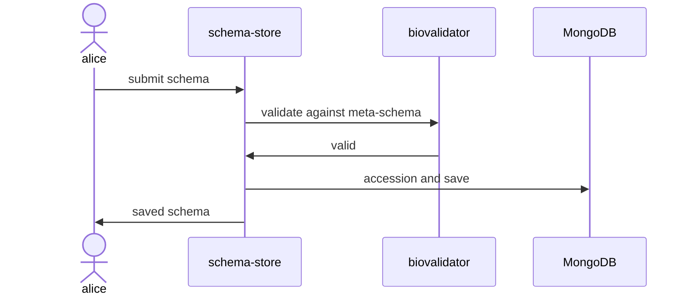

# Project Details

## Tech Stack
- Java
- SpringBoot 3
- Angular
- MongoDB
- Maven

*Note*: 
`frontend-maven-plugin` is used to build and copy Angular project during the build process. Threfore, whole application is packaged in the final jar. 


### APIs
| Action             | Endpoint                            | Method | Body     |
|--------------------|-------------------------------------|--------|----------|
| Get schema         | `api/v2/schemas/ERC000022?id=<$id>` | GET    |          |
| Get schema version | `api/v2/schemas/ERC000022/1.0.0`    | GET    |          |
| Create schema      | `api/v2/schemas`                    | POST   | [SCHEMA with metadata] |
| Update schema      | `api/v2/schemas?id=<$id>`           | PUT    | [SCHEMA] |
| Delete schema      | `api/v2/schemas?id=<$id>`           | DELETE |          |
| Get all schema     | `/api/v2/schemas/search`            | GET    |          | 
  
#### Vanilla schema endpoints
Vanilla schema endpoints can be used to retrieve schema without wrappping metadata. These endpoints are useful when dealing with JSON Schema validators. 

| Action                                    | Endpoint                                  |
|-------------------------------------------|-------------------------------------------|
| Get latest vanilla schema by id           | `/registry/schemas?id=<$id>`              |
| Get latest vanilla schema by accession    | `/registry/schemas/{accession}`           |
| Get versioned vanilla schema by accession | `/registry/schemas/{accession}/{version}` | 


### Submit schema

#### Example
```shell
curl -u <user>:<pass> 'http://localhost:8080/api/v2/schemas' -i -X POST -H "Content-Type: application/json;charset=UTF-8" -d '{
"id":"https://www.ebi.ac.uk/biosamples/schemas/biosamples-test/1.0.0",
"name":"biosamples-test","version":"1.0.0","title":"BioSamples test checklist",
"description":"Minimum required fields to submit a sample into EBI BioSamples database",
"domain":"https://www.ebi.ac.uk/biosamples/schemas",
"metaSchema":"https://schemablocks.org/metaschemas/json-schema-draft-07/1.0.1",
"schema":{"$schema":"http://json-schema.org/draft-07/schema#","$id":"https://www.ebi.ac.uk/biosamples/schemas/biosamples-test/1.0.0","additionalProperties":true,"definitions":{"nonEmptyString":{"type":"string","minLength":1}},"required":["name","characteristics"],"title":"sample","type":"object","properties":{"name":{"type":"string"},"accession":{"type":"string"},"characteristics":{"type":"object","anyOf":[{"required":["organism"]},{"required":["Organism"]},{"required":["species"]},{"required":["Species"]}],"properties":{"organism":{"type":"array","items":{"properties":{"text":{"$ref":"#/definitions/nonEmptyString"}},"required":["text"]}},"Organism":{"type":"array","items":{"properties":{"text":{"$ref":"#/definitions/nonEmptyString"}},"required":["text"]}},"Species":{"type":"array","items":{"properties":{"text":{"$ref":"#/definitions/nonEmptyString"}},"required":["text"]}},"species":{"type":"array","items":{"properties":{"text":{"$ref":"#/definitions/nonEmptyString"}},"required":["text"]}}}}}},
"authority":"BIOSAMPLES"
}'
```

### DB Structure
`schema-store` has two collections: `schema` and `metascham`. Both of these collections have similar document structure. 
#### Document structure of `schema` collection 
```mermaid
erDiagram
schema {
        string _id PK "$id field of the schema is copied to the top level _id field"
        string accession " [Auto-generated field. Starting from prefix 'BSDC'. ENA checklists are imported with 'ERC' prefix]"
        string title "Title of the schema"
        string description "Schema description"
        string metaSchema "Meta-schema to validate against"
        string schema "Schema to be stored. Schema is stored as a string field in the database"
        string version "version"
        string domain "Placeholder for AAP domain. But this field is no longer needed"
        string authority "Field to mark the origin of the schema. Current values 'BIOSAMPLES', 'ENA'"
    } 'ENA']
#### Example
```json
{
    "_id" : "https://www.ebi.ac.uk/biosamples/schemas/biosamples-minimal/1.0.0",
    "accession" : "BSDC00001",
    "title" : "BioSamples minimal checklist",
    "description" : "Minimum required fields to submit a sample into EBI BioSamples database",
    "metaSchema" : "https://schemablocks.org/metaschemas/json-schema-draft-07/1.0.1",
    "schema" : "{\"$schema\":\"http://json-schema.org/draft-07/schema#\",\"$id\":\"https://www.ebi.ac.uk/biosamples/schemas/biosamples-minimal/1.0.0\",\"additionalProperties\":true,\"definitions\":{\"nonEmptyString\":{\"type\":\"string\",\"minLength\":1}},\"required\":[\"name\",\"characteristics\"],\"title\":\"sample\",\"type\":\"object\",\"properties\":{\"name\":{\"type\":\"string\"},\"accession\":{\"type\":\"string\"},\"characteristics\":{\"type\":\"object\",\"anyOf\":[{\"required\":[\"organism\"]},{\"required\":[\"Organism\"]},{\"required\":[\"species\"]},{\"required\":[\"Species\"]}],\"properties\":{\"organism\":{\"type\":\"array\",\"items\":{\"properties\":{\"text\":{\"$ref\":\"#/definitions/nonEmptyString\"}},\"required\":[\"text\"]}},\"Organism\":{\"type\":\"array\",\"items\":{\"properties\":{\"text\":{\"$ref\":\"#/definitions/nonEmptyString\"}},\"required\":[\"text\"]}},\"Species\":{\"type\":\"array\",\"items\":{\"properties\":{\"text\":{\"$ref\":\"#/definitions/nonEmptyString\"}},\"required\":[\"text\"]}},\"species\":{\"type\":\"array\",\"items\":{\"properties\":{\"text\":{\"$ref\":\"#/definitions/nonEmptyString\"}},\"required\":[\"text\"]}}}}}}",
    "name" : "biosamples-minimal",
    "version" : "1.0.0",
    "domain" : "https://www.ebi.ac.uk/biosamples/schemas",
    "authority" : "BIOSAMPLES",
    "_class" : "uk.ac.ebi.biosamples.jsonschemastore.model.mongo.MongoJsonSchema"
}
```

